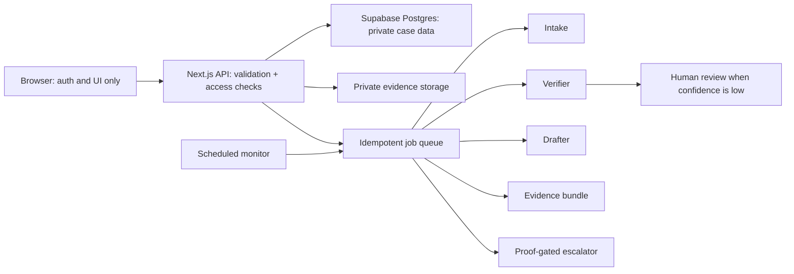

<div align="center">

# Unhold

**A guided case workspace for people in India dealing with a bank-account or UPI restriction.**

Unhold organises the facts, checks uploaded evidence, drafts review-before-send letters,
and tracks follow-ups. It does not contact a bank, police authority, or regulator for the user,
and it does not promise that an account will be released.

[](https://github.com/thribhuvan003/unhold/actions/workflows/ci.yml)
[](https://www.unhold.live)
[](https://www.typescriptlang.org/)
[](https://nextjs.org/)

### [See the worked example — no sign-up](https://www.unhold.live/demo)

</div>

## Three-minute reviewer path

1. Open the [worked example](https://www.unhold.live/demo) on a phone-sized screen.
2. Inspect the server-only data boundary in
   [`20260713194008_server_only_data_boundary.sql`](supabase/migrations/20260713194008_server_only_data_boundary.sql)
   and the proof gates in [`lib/escalations/proof-gates.ts`](lib/escalations/proof-gates.ts).
3. Run `pnpm verify` to exercise lint, strict type checking, unit tests, API contract tests,
   the no-auto-send guard, and a production build.

## What the product does

- **Guided intake:** turns a stressful story into structured case facts without requiring an account.
- **Evidence handling:** uses private storage, SHA-256 integrity checks, consent-gated extraction,
  and human review when model confidence is low.
- **Case-aware drafts:** produces concise letters from recorded facts and rejects citations outside
  the maintained legal allowlist.
- **Proof-gated escalation:** a later step cannot be marked sent until the required earlier proof exists.
- **Persistent follow-up:** idempotent jobs and monitored deadlines preserve the case history across visits.
- **User control:** every external submission is copy-only and review-before-send; the product never auto-sends.

## Safety boundary

Unhold is an information and document-organisation tool, not a law firm or government service.
Different restrictions can come from different authorities and require different remedies. The UI therefore
labels uncertainty, keeps sources and review dates with legal positions, and avoids release guarantees or
fixed outcome timelines. See [`docs/PRODUCT_AND_SAFETY.md`](docs/PRODUCT_AND_SAFETY.md).

## Architecture



The browser's Supabase client is used for authentication only. Application tables and RPCs are not granted
to `anon` or `authenticated`; authorised server routes use the service role after explicit owner,
collaborator, or operator checks. Agent outputs are schema-validated, jobs are idempotent and retry with
bounded backoff, and deterministic fallbacks keep the core workflow available without an LLM.

### Model routing

| Workload                         | Primary                          | Fallback                             |
| -------------------------------- | -------------------------------- | ------------------------------------ |
| Text classification and drafting | Groq `openai/gpt-oss-120b`       | NVIDIA `meta/llama-3.3-70b-instruct` |
| Image understanding              | Groq `qwen/qwen3.6-27b`          | NVIDIA `minimaxai/minimax-m3`        |
| Retrieval embeddings             | NVIDIA `nvidia/nv-embedqa-e5-v5` | Deterministic template path          |

Provider output is treated as untrusted: it must pass Zod schemas, citation controls, redaction, and the
applicable proof gate before it can affect a case.

## Local setup

Requirements: Node.js 22.14+ and pnpm 10.12.1.

```bash
git clone https://github.com/thribhuvan003/unhold.git
cd unhold
pnpm install --frozen-lockfile
cp .env.example .env.local
pnpm dev
```

Use local/test credentials in `.env.local`; never commit a filled environment file. The complete key list
and deployment notes are in [`config/VERCEL_ENV_KEYS.md`](config/VERCEL_ENV_KEYS.md) and
[`docs/DEPLOY_VERCEL_HOBBY.md`](docs/DEPLOY_VERCEL_HOBBY.md).

## Verification

```bash
pnpm verify             # lint + types + unit + contracts + safety guard + build
pnpm test:e2e:smoke     # Playwright desktop and mobile smoke journeys
pnpm test:e2e           # complete browser suite
```

CI repeats the deterministic verification on every pull request and on pushes to `main` or `codex/**`,
then runs secret scanning and browser smoke tests. Test totals are intentionally not hard-coded here;
the workflow is the source of truth.

## Repository map

```text
app/                    Next.js App Router UI and versioned API routes
components/             Product UI, including mobile-first case workflow
lib/agents/             Intake, verification, drafting, evidence, monitor, escalator
lib/api/                Authentication, authorisation, error, and request contracts
lib/escalations/        Deterministic proof gates
lib/jobs/               Idempotent queue, claims, retry, and dispatch
supabase/migrations/    Reproducible schema, RLS, storage, and privilege controls
tests/unit/             Domain logic and golden agent fixtures
tests/contract/         API and migration contracts
tests/e2e/              Desktop/mobile user journeys and accessibility checks
```

## Current limitations

- The user must verify every extracted fact and send every letter themselves.
- Legal/process information can change; dated sources are guidance, not individual legal advice.
- Model checks can be wrong. Low-confidence or inconsistent evidence is routed to review.
- Outcome and timing depend on the bank, freezing authority, facts, and applicable law.

Security reports are handled through [`SECURITY.md`](SECURITY.md). Contributions are described in
[`CONTRIBUTING.md`](CONTRIBUTING.md).

---

Built by [thribhuvan003](https://github.com/thribhuvan003).
