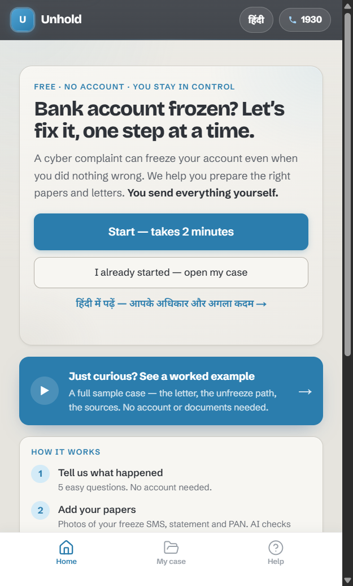
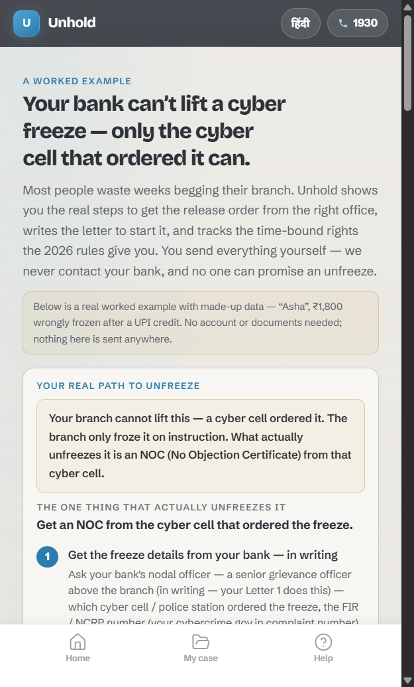
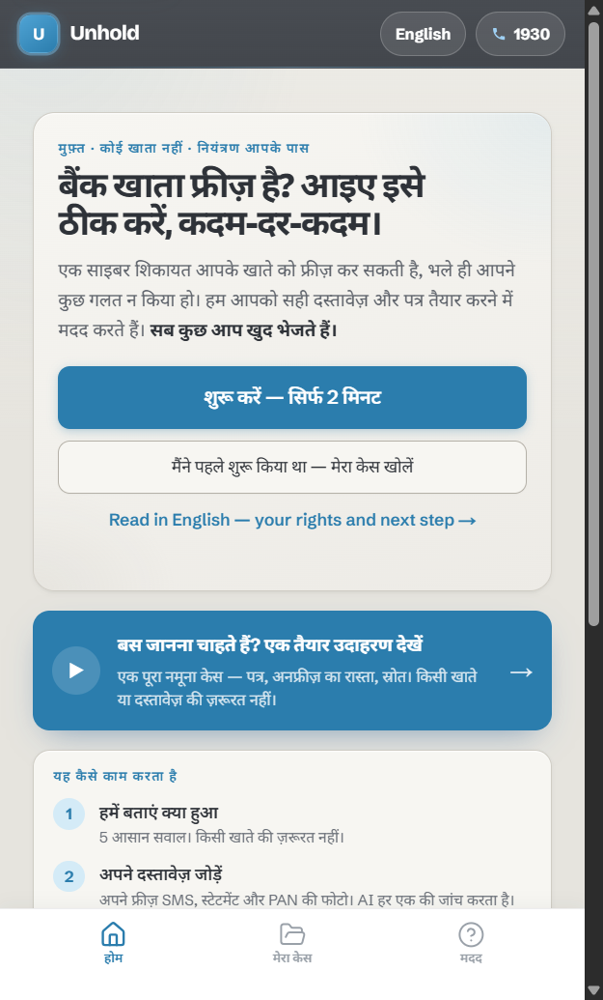
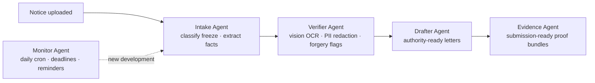

<div align="center">

# Unhold

**An AI case manager for bank & UPI account freezes.**

Account frozen out of nowhere? Unhold turns a confusing legal notice into a
guided, step-by-step resolution — with a verified multi-agent pipeline doing
the document work.

[](https://unholdd.vercel.app)
[](https://nextjs.org)
[](https://www.typescriptlang.org)
[](#testing)
[](https://build.nvidia.com)

### [▶ See a worked example — no signup](https://unholdd.vercel.app/demo)

Walk a real frozen-account case end to end with sample data, no account or
documents required.

| Guided start | The worked example | Full Hindi (हिंदी) |
| :---: | :---: | :---: |
|  |  |  |

</div>

---

## Why this beats asking ChatGPT

- **Dated, sourced law — and it flags what's contested.** Every legal position carries a source and a `current`/`contested` tag ([`lib/legal/positions.ts`](lib/legal/positions.ts)); a general model states pre-cutoff law as settled and can't tell you the blanket-freeze rulings are under Supreme Court appeal.
- **It routes you to who can actually unfreeze you.** Your bank branch cannot lift a cyber-cell freeze — the cyber cell's NOC can. Unhold names the real track and key step per freeze type ([`lib/case/unfreeze-path.ts`](lib/case/unfreeze-path.ts)); a chatbot hands you a generic letter to the wrong desk.
- **An LLM can never introduce an unvetted legal citation.** Model drafts pass a statute allowlist — any citation beyond the vetted BNSS 106/107, any repealed IPC/CrPC reference, or any police-freeze citation on a court/tax/KYC track is rejected and the letter falls back to deterministic, human-vetted templates ([`lib/agents/validators.ts`](lib/agents/validators.ts)). Kill the API key and the product still works.
- **Stateful, proof-gated escalation.** A case advances through a deterministic state machine, and an escalation can't be approved or sent without the required evidence on file ([`lib/escalations/proof-gates.ts`](lib/escalations/proof-gates.ts)).
- **It remembers your case.** Facts, documents, and deadlines persist and drive daily follow-ups — not a one-shot answer you have to re-explain every time.

---

## The problem

In India, bank accounts and UPI IDs get frozen by cyber-cell orders with little
explanation. Victims face weeks of guesswork: which authority froze the account,
what documents to gather, whom to write to, and how to follow up. Most people
either pay agents or give up.

Unhold automates that entire loop.

## What it does

- **Explains the freeze** — parses the notice and produces plain-language next steps
- **Verifies documents** — vision OCR with PII redaction and forgery flags; low-confidence results go to human review, never guessed
- **Drafts the paperwork** — authority-ready letters grounded in the case facts, with graded escalation levels
- **Bundles evidence** — assembles submission-ready proof packs for each authority
- **Keeps cases moving** — daily cron sweeps track deadlines and trigger reminders

## Architecture

### Five-agent pipeline

Each agent owns one stage of a case. Four run as idempotent jobs on a queue;
the Monitor runs on a daily Vercel cron. A deterministic state machine — not
the LLM — decides what happens next.



Every agent job carries an idempotency key, and every output is validated
against a Zod schema before it can advance a case. When a provider fails, the
system degrades to deterministic templates instead of erroring.

### LLM routing

| Task | Primary | Fallback |
|---|---|---|
| Text — classification, drafting | Groq · Llama 3.3 70B | NVIDIA NIM · Llama 3.3 70B |
| Vision — document OCR | NVIDIA NIM · MiniMax-M3 (multimodal) | Deterministic templates |

Each provider rotates across a key pool with automatic 429 failover. The chat
layer never throws — callers always land on a safe fallback path.

### Trust & safety by design

- **Recorded consent** — the vision-OCR path is hard-gated on a per-case consent record; no document is AI-processed without it
- **Append-only audit log** — `action_logs` is immutable at the database level (a trigger rejects `UPDATE` and `DELETE`), with 8-year retention
- **Proof gates** — an escalation cannot be approved or marked sent without the required evidence on file
- **PII redaction** — extracted fields, mismatches, and forgery flags are redacted before storage
- **Human-in-the-loop** — low-confidence OCR or classification is flagged `human_review_required` instead of silently accepted

## Testing

**341 automated test cases** across five suites:

| Suite | Command | What it proves |
|---|---|---|
| Unit + golden agent fixtures | `pnpm test:unit` | Agent logic against golden transcripts |
| Contract | `pnpm test:contract` | API request/response contracts |
| RLS integration | `pnpm test:rls` | Postgres Row-Level Security isolation |
| Integration | `pnpm test:integration` | Cross-module flows |
| E2E (Playwright) | `pnpm test:e2e` | Real user journeys, `@smoke` tagged |

## Repository structure

```
unhold/
├── app/                       Next.js App Router — product UI + versioned API
│   └── api/v1/                REST endpoints, cron routes, job-queue processor
├── lib/
│   ├── agents/                Intake · Verifier · Drafter · Evidence · Monitor,
│   │                          plus router, schemas, and validators
│   ├── state-machine/         Deterministic case-status transitions
│   ├── escalations/           Proof gates — evidence required before escalation
│   ├── redaction/             PII redaction for every stored LLM output
│   ├── consent/               Recorded per-purpose consent (gates AI OCR)
│   ├── llm/                   Groq + NVIDIA NIM routing, key rotation, 429 failover
│   ├── action-logs/           Append-only audit trail (DB-enforced immutability)
│   └── jobs/                  Idempotent agent job queue
├── supabase/migrations/       Postgres schema, RLS policies, immutable audit tables
├── tests/                     unit · contract · integration (RLS) · golden · e2e
└── vercel.json                Crons, per-route limits, security headers (HSTS,
                               nosniff, X-Frame-Options)
```

## Tech stack

Next.js 16 · TypeScript (strict) · Supabase (Postgres + RLS + Auth) · Groq ·
NVIDIA NIM (MiniMax-M3) · Zod · Vitest · Playwright · Vercel (Mumbai, `bom1`)

## Status

Live at [unholdd.vercel.app](https://unholdd.vercel.app) — actively developed.

---

<div align="center">

Built by [Thribhuvan](https://github.com/thribhuvan003)

</div>
