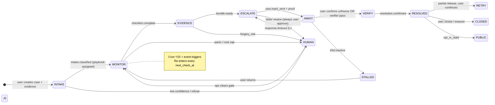

# LienLiberator — Loop Engineering BUILD_SPEC (v1.0)

**Status:** Copy-paste implementable. Karpathy bounded-agent loops + Claude implementer/verifier harness.  
**Parent:** `BUILD_SPEC.md` v3 §2 (job flow), §4 (state machine), §15 (crons)  
**Sibling:** `BUILD_SPEC_AGENTS.md` (agent schemas, tools, prompts)  
**Repo root:** `lienliberator/`

---

## How Implementers Use This Document

1. **Loop hierarchy:** OUTER (weeks) → INNER (per tick) → AGENT (per job) → DEV (per slice)
2. **Never bypass:** All status changes via `transition_case()` guards; agents enqueue jobs only
3. **Idempotency everywhere:** Same cron tick twice = zero duplicate side effects
4. **Human gates are loop nodes**, not post-processing — loop blocks until gate clears or routes to `human_escalation`
5. **Source of truth order:** This file → `BUILD_SPEC_AGENTS.md` → `supabase/migrations/*`

---

## 1. OUTER LOOP — Case Lifecycle (Product Loop, Weeks)

Persistent swarm runs until **terminate** or **stall+close**. One case = one long-running loop, not a one-shot agent call.

### 1.1 Lifecycle diagram



### 1.2 Outer loop pseudocode (orchestrator-level)

```
OUTER_LOOP(case_id):
  WHILE case.status NOT IN TERMINAL_STATUSES:
    IF case.swarm_paused OR human_gate_pending(case_id):
      SLEEP until gate cleared OR ops timeout policy
      CONTINUE

    IF case.agent_cost_usd >= case.agent_cost_cap_usd:
      transition(* → human_escalation, event=cost_cap)
      CONTINUE

    tick_result = INNER_LOOP(case_id)          // §2
    APPLY tick_result.side_effects             // next_check_at, user_actions only
    EMIT swarm_events + Realtime

    IF tick_result.spawn_jobs:
      AGENT_LOOP(case_id, tick_result.spawn_jobs)  // §3

    IF tick_result.suggest_transition AND confidence >= 0.80:
      // suggest only — user or guarded API applies
      enqueue_user_action(suggest_transition)

  ON exit: append action_log, freeze agent_jobs for case
```

### 1.3 Phase mapping (typical innocent-receiver SBI, 12–90 days)

| Week | Outer phase | Primary agents | Human gates |
|------|-------------|----------------|-------------|
| 0 | INTAKE | INTAKE, VERIFIER | classify <0.75 |
| 1 | MONITOR + EVIDENCE | MONITOR, EVIDENCE | checklist items |
| 2–3 | ESCALATE L1 | DRAFTER, MONITOR | approve + mark-sent |
| 3–4 | AWAIT L1 (7d) | MONITOR | — |
| 4–5 | ESCALATE L2 | ESCALATOR → DRAFTER | L1 proof gate |
| 6–14 | AWAIT L2 (10d) | MONITOR | — |
| 14+ | ESCALATE L3 | ESCALATOR → DRAFTER | L2 proof + consent |
| 14–26 | AWAIT L3 (90d) | MONITOR | statutory reminders |
| * | VERIFY → RESOLVED | VERIFIER, user confirm | resolution type |

---

## 2. INNER LOOP — Monitor Tick (Per Cron/Event)

**Entry:** `POST /api/v1/internal/cron/tick` OR event trigger (evidence confirm, mark-sent, user transition).  
**Handler:** `lib/loops/case-tick.ts` → `runCaseTick()`.  
**Budget:** ≤30s per case; batch cron processes ≤50 cases per invocation.

### 2.1 Monitor tick pseudocode

```
INNER_LOOP(case_id, trigger):
  // ── Acquire lock ──────────────────────────────────────────────
  lock = redis.set(`case_tick:${case_id}`, NX, EX=120)
  IF NOT lock: RETURN { skipped: true, reason: 'concurrent_tick' }

  case = get_case(case_id)
  tick_id = uuid()

  // ── Exit conditions (early return, still idempotent) ──────────
  IF case.status IN TERMINAL_STATUSES:
    RETURN { exit: 'terminal', next_check_at: null }

  IF case.swarm_paused:
    RETURN { exit: 'paused', next_check_at: case.next_check_at }

  IF case.next_check_at > now() AND trigger.type == 'cron':
    RETURN { exit: 'not_due', next_check_at: case.next_check_at }

  IF pending_human_gate(case_id):
    RETURN { exit: 'human_gate', next_check_at: add_hours(now(), 6) }

  // ── Idempotency bucket ────────────────────────────────────────
  bucket = floor_to_15min(now())  // matches cron */15
  idem_key = `monitor_tick:${case_id}:${bucket}`

  // ── Route spawn set via Lead Router ───────────────────────────
  router_plan = routeCaseJobs(case, trigger)   // lib/agents/router.ts

  // ── Persist schedule before jobs (crash-safe) ─────────────────
  next_check = compute_next_check(case, router_plan)
  upsert_case({ next_check_at: next_check, last_activity_at: now() })

  // ── Enqueue jobs (deduped by idempotency_key) ─────────────────
  jobs_enqueued = []
  FOR job IN router_plan.jobs:
    IF job.enqueue:
      jobs_enqueued.push(enqueue_agent_job(job))  // UNIQUE idempotency_key

  append_swarm_event({
    event_type: 'tick_completed',
    message: `Monitor tick ${tick_id}: ${jobs_enqueued.length} jobs`,
    metadata: { tick_id, trigger, jobs: jobs_enqueued.map(j => j.job_type) }
  })

  RETURN {
    tick_id,
    spawn_jobs: jobs_enqueued,
    next_check_at: next_check,
    exit: 'completed'
  }

FINALLY:
  redis.del(`case_tick:${case_id}`)
```

### 2.2 Inner loop exit conditions

| Exit code | Meaning | Sets `next_check_at` |
|-----------|---------|----------------------|
| `terminal` | `resolved` \| `closed` \| erasure complete | `null` |
| `paused` | `swarm_paused=true` (user or ops) | unchanged |
| `not_due` | cron fired early | unchanged |
| `human_gate` | pending row in `human_gate_queue` | +6h poll |
| `concurrent_tick` | Redis lock held | unchanged |
| `completed` | normal tick | computed schedule |
| `cost_cap` | `agent_cost_usd >= cap` | `null` (outer routes human) |

### 2.3 `compute_next_check()` rules

```typescript
// lib/loops/scheduling.ts
function computeNextCheck(case: CaseRow): Date {
  const days = daysSince(case.created_at);
  if (case.status === 'awaiting_response' && case.escalation_response_due_at) {
    // Wake 1 day before statutory deadline
    return subDays(case.escalation_response_due_at, 1);
  }
  if (days <= 7) return addHours(now(), 24);      // max 1/day equivalent
  if (days <= 30) return addDays(now(), 3);       // ~2/week
  if (days <= 90) return addDays(now(), 7);       // 1/week
  return addDays(now(), 14);                      // long-tail stall watch
}
```

---

## 3. AGENT LOOP — Karpathy Team (Lead Router → Bounded Workers)

**Pattern:** Lead Router (non-LLM) reads shared state → spawns specialized agents in **bounded tool loops** → verifier gates before side effects.

### 3.1 Architecture diagram

```
                    ┌─────────────────┐
                    │  LEAD ROUTER    │  lib/agents/router.ts
                    │  (no LLM)       │  reads: cases, agent_jobs, gates
                    └────────┬────────┘
                             │
         ┌───────────────────┼───────────────────┐
         │ PARALLEL (safe)   │                   │ SEQUENTIAL (proof)
         ▼                   ▼                   ▼
    ┌─────────┐        ┌──────────┐       ┌────────────┐
    │ INTAKE  │        │ MONITOR  │       │ ESCALATOR  │
    │ VERIFIER│        │ EVIDENCE │       │     ↓      │
    └────┬────┘        └────┬─────┘       │  DRAFTER   │
         │                  │             └─────┬──────┘
         └────────┬─────────┘                   │
                  ▼                               ▼
           ┌─────────────┐                 ┌─────────────┐
           │ agent_jobs  │ ──process──▶   │ Zod parse   │
           │   queue     │                 │ validators  │
           └─────────────┘                 │ human_gate? │
                                           └──────┬──────┘
                                                  ▼
                                           swarm_events + user_actions
```

### 3.2 Parallel vs sequential spawn rules

| Agent | Parallel with | Must wait for | Proof gate |
|-------|---------------|---------------|------------|
| INTAKE | VERIFIER (per evidence) | — | — |
| VERIFIER | INTAKE | — | human if conf <0.85 |
| MONITOR | INTAKE, VERIFIER, EVIDENCE | — | never auto-transition |
| EVIDENCE | MONITOR | checklist_complete guard | bundle SHA-256 |
| ESCALATOR | — | prior level `sent` + proof | `check_proof_gates` |
| DRAFTER | — | ESCALATOR job OR user unlock | user approve API |
| PRESSURE | all | case not PII | aggregate only |

**ESCALATOR → DRAFTER chain:** Router enqueues ESCALATOR first; ESCALATOR output calls `enqueue_drafter_job` only if `proof_gates_met=true`. DRAFTER never runs in same process tick as ESCALATOR — separate `agent_jobs` rows.

### 3.3 Per-agent bounded loop (runner)

```
AGENT_LOOP(job):
  role = job.agent_role
  tools = TOOL_REGISTRY.filter(t => t.allowed_roles.includes(role))
  model = routeModel(role, { agent_cost_usd, level, evidence_count })

  IF model == 'HUMAN_OPS':
    enqueue_human_gate(case_id, 'agent_cost_cap')
    RETURN

  messages = [system_prompt(role), user_payload(job.payload)]
  attempts = 0
  MAX_TOOL_ROUNDS = 8

  WHILE attempts < MAX_TOOL_ROUNDS:
    response = claude.messages.create({ model, tools, messages })
    IF response.stop_reason == 'end_turn':
      output = parse_json(response)
      validated = ZodSchema[role].parse(output)
      post_validate(validated, input_manifest)
      IF validated.human_gate_required:
        enqueue_human_gate(...)
      APPLY allowed side effects via tools only
      mark_job_completed(job, validated)
      RETURN

    IF response.stop_reason == 'tool_use':
      FOR each tool_call IN response.tool_calls:
        assert tool_call.name NOT IN FORBIDDEN_TOOL_NAMES
        assert tool_call.name IN tools
        result = execute_tool(tool_call)
        messages.append(tool_result)
    attempts++

  mark_job_failed(job, 'max_tool_rounds')
  enqueue_human_gate(case_id, 'agent_loop_exhausted')
```

---

## 4. DEV LOOP — Claude Builds Software (Implementer Harness)

**Purpose:** When AI implements LienLiberator slices, run a **file-level** Plan → Implement → Test → Review → Fix loop until green — not one-shot codegen.

### 4.1 Dev loop diagram

```
┌──────┐   ┌────────────┐   ┌──────┐   ┌────────┐   ┌─────┐
│ Plan │──▶│ Implement  │──▶│ Test │──▶│ Review │──▶│ Fix │──┐
│ slice│   │ 1 file set │   │ vitest│   │ diff  │   │     │  │
└──────┘   └────────────┘   └──────┘   └────────┘   └─────┘  │
     ▲                                                          │
     └──────────────────── until all gates green ──────────────┘
```

### 4.2 Gate checklist (per slice)

| Gate | Command | Pass condition |
|------|---------|----------------|
| Typecheck | `pnpm tsc --noEmit` | 0 errors |
| Unit | `pnpm vitest run tests/unit` | all pass |
| Guards | `pnpm vitest run tests/unit/state-machine` | 50/50 |
| Contract | `pnpm vitest run tests/contract` | 23 routes |
| No auto-send | `scripts/verify-no-auto-send.sh` | exit 0 |
| Golden agents | `pnpm vitest run tests/golden` | ≥18/20 |
| E2E smoke | `pnpm playwright test --grep @smoke` | 8/8 |

### 4.3 Slice boundaries (one dev loop iteration = one slice from BUILD_SPEC §13)

```
Slice 9 example (cron tick):
  ALLOWED_FILES = [
    'lib/loops/case-tick.ts',
    'lib/loops/scheduling.ts',
    'lib/agents/router.ts',
    'app/api/v1/internal/cron/tick/route.ts',
    'tests/unit/loops/case-tick.test.ts',
  ]
  FORBIDDEN = any route that auto-sends email
```

---

## 5. State on Disk (Persists Between Loop Iterations)

### 5.1 `cases` — loop control fields

| Column | Loop role |
|--------|-----------|
| `status` | outer loop phase (enum §4) |
| `next_check_at` | inner loop wake time |
| `swarm_paused` | hard pause (user/ops) |
| `agent_cost_usd` | cumulative LLM spend |
| `agent_cost_cap_usd` | default 2.00 → terminate agent loop |
| `user_action_required` | inbox flag |
| `next_user_action_type` | NextStepsCard driver |
| `next_user_action_due_at` | reminder scheduling |
| `escalation_level` | L1–L4 ladder position |
| `playbook_id` | frozen playbook version at classify |
| `classification_confidence` | INTAKE output |
| `last_activity_at` | stall detection (45d) |
| `stalled_at` | outer loop branch |
| `resolved_at` / `closed_at` | termination timestamps |
| `metadata_json` | `last_tick_id`, `loop_version` |

### 5.2 `agent_jobs` — durable work queue

| Column | Loop role |
|--------|-----------|
| `idempotency_key` | dedup: `{job_type}:{case_id}:{bucket\|event_id}` |
| `job_type` | `intake_classify`, `monitor_tick`, `draft_letter`, … |
| `status` | `pending` → `running` → `completed` \| `failed` |
| `scheduled_at` | delayed retry |
| `attempts` / `max_attempts` | bounded retry (3) |
| `payload_json` | agent input snapshot |
| `result_json` | Zod-validated output |
| `cost_usd` | per-job token cost |

### 5.3 `swarm_events` — append-only observability + Realtime

| Column | Loop role |
|--------|-----------|
| `event_type` | `tick_completed`, `classified`, `letter_drafted`, `cost_cap_hit` |
| `agent_role` | which agent emitted |
| `job_id` | FK → `agent_jobs` |
| `automated` | `false` for human_ops |
| `metadata_json` | `{ tick_id, idempotency_key, spawn_plan }` |

### 5.4 Other loop-critical tables

| Table | Persists |
|-------|----------|
| `escalations` | per-level drafts, `sent_at`, `response_due_at`, proof IDs |
| `user_actions` | inbox items across ticks |
| `action_logs` | guarded transitions audit |
| `human_gate_queue` | open gates block inner loop |
| `consent_records` | L3 `escalation_send` gate |
| `evidence` | SHA-256, `vision_extracted` for VERIFIER |
| Redis | `case_tick:{id}` lock, API idempotency keys (24h) |

### 5.5 What is NOT persisted in loop state

- LLM chat history (rebuild from `payload_json` + DB facts each job)
- In-memory router plans (recomputed each tick)
- Vercel cron invocation payload

---

## 6. Loop Triggers

| Trigger | Entrypoint | Calls | Notes |
|---------|------------|-------|-------|
| **Cron tick** | `POST /internal/cron/tick` */15 | `runBatchCaseTicks()` | `next_check_at <= now()` |
| **Cron jobs** | `POST /internal/jobs/process` */5 | `processAgentJobs()` | drain `agent_jobs` |
| **Cron reminders** | `POST /internal/cron/reminders` 09:00 IST | day-bucket reminders | respects quiet hours |
| **User: evidence confirm** | `POST .../evidence/{eid}/confirm` | `runCaseTick(id, {type:'evidence_confirm'})` | spawns VERIFIER |
| **User: transition** | `POST .../transitions` | `runCaseTick(id, {type:'transition', event})` | after `transition_case()` |
| **User: mark-sent** | `POST .../mark-sent` | `runCaseTick(id, {type:'mark_sent'})` | sets `response_due_at` |
| **User: approve letter** | `POST .../approve` | enqueue `draft_letter` if redraft |
| **Webhook** (Phase 2) | Razorpay payment | tier unlock in `fee_agreements` only | does NOT skip proof gates |
| **Realtime** (client) | Supabase subscribe | UI refresh only | does NOT spawn agents |
| **Cost cap** | MONITOR/INTAKE any job | `transition_case(→ human_escalation)` | immediate |

### 6.1 Cron auth + lock

```typescript
// Every internal route
assertBearer(req, process.env.CRON_SECRET);
const lock = await redis.set(`cron:tick:${bucket}`, '1', { nx: true, ex: 840 });
if (!lock) return Response.json({ skipped: true });
```

---

## 7. Loop Termination Conditions (Per Case)

### 7.1 Terminal statuses (outer loop exits)

| Status | Condition | Agent jobs |
|--------|-----------|------------|
| `resolved` | `resolution_type` set + user confirmed | cancel pending |
| `closed` | user closed or ops closed | cancel pending |
| `human_escalation` | **soft terminal for automation** — ops owns; cron polls every 24h only | pause LLM jobs |

### 7.2 Hard stop predicates

```typescript
const TERMINAL_STATUSES = ['resolved', 'closed'] as const;

function shouldTerminateLoop(case: CaseRow): TerminationReason | null {
  if (TERMINAL_STATUSES.includes(case.status)) return 'terminal_status';
  if (case.erasure_completed_at) return 'erasure_complete';
  if (case.status === 'human_escalation' && case.metadata_json?.ops_automation_off)
    return 'human_escalation_permanent';
  if (daysSince(case.created_at) > 365 && case.status === 'stalled')
    return 'max_case_age'; // ops review → closed
  return null;
}
```

### 7.3 Non-terminal but loop-slowed

| State | Behavior |
|-------|----------|
| `stalled` | `next_check_at` = +14d; MONITOR only |
| `swarm_paused` | no spawns until user resumes |
| `awaiting_response` | MONITOR + ESCALATOR on timeout only |
| `verified` | user must confirm resolution_type |

---

## 8. Idempotency in Loops

**Rule:** Same tick twice = same DB state (except `attempts` on failed jobs).

### 8.1 Key formats

| Operation | `idempotency_key` pattern | TTL / scope |
|-----------|---------------------------|-------------|
| Monitor tick | `monitor_tick:{case_id}:{yyyyMMddHHmm15}` | 15-min bucket |
| Intake classify | `intake_classify:{case_id}:{intake_hash}` | per intake version |
| Verifier | `verifier:{evidence_id}:{sha256_prefix}` | per evidence blob |
| Draft letter | `draft_letter:{case_id}:{level}:{template_version}` | per level |
| Escalator | `escalator:{case_id}:{level}:{sent_at_date}` | per timeout event |
| Evidence bundle | `evidence_bundle:{case_id}:{manifest_sha256}` | per manifest |
| API transitions | header `Idempotency-Key` | Redis 24h |
| Cron batch | `cron:tick:{bucket}` | Redis 14min |

### 8.2 Enqueue semantics

```typescript
// lib/jobs/enqueue.ts
async function enqueueAgentJob(input: EnqueueInput): Promise<EnqueueResult> {
  const { data, error } = await supabase
    .from('agent_jobs')
    .upsert(
      {
        case_id: input.case_id,
        job_type: input.job_type,
        agent_role: input.agent_role,
        idempotency_key: input.idempotency_key,
        payload_json: input.payload,
        status: 'pending',
        scheduled_at: input.scheduled_at ?? new Date().toISOString(),
      },
      { onConflict: 'idempotency_key', ignoreDuplicates: true }
    )
    .select()
    .single();

  if (error?.code === '23505') return { enqueued: false, duplicate: true };
  return { enqueued: true, job_id: data.id };
}
```

### 8.3 Tick-level guarantees

1. Redis `case_tick:{id}` prevents concurrent inner loops
2. `next_check_at` updated before job enqueue (crash → retry jobs, not double schedule)
3. `swarm_events` for `tick_completed` uses `metadata.tick_id` — UI dedupes display
4. `transition_case()` is guarded — duplicate transition events return 422, not double-write

---

## 9. Human-in-the-Loop Gates IN the Loop

Gates are **blocking nodes** — inner loop returns `exit: 'human_gate'` until resolved.

### 9.1 Gate inventory

| Gate ID | Trigger | Loop behavior | Clear condition |
|---------|---------|---------------|-----------------|
| `intake_low_confidence` | INTAKE conf <0.75 | pause classify transition | ops affirms or user adds evidence |
| `verifier_low_confidence` | VERIFIER conf <0.85 | block `evidence_building` | ops/manual OCR |
| `forgery_risk` | VERIFIER | block bundle | ops reject evidence |
| `drafter_review` | DRAFTER always | block `approve` API path | user clicks approve (API) |
| `escalation_send_consent` | L3 | block mark-sent | `consent_records.escalation_send` |
| `proof_gate` | L2/L3/L4 | ESCALATOR refuses DRAFTER | user mark-sent + proof_evidence_id |
| `panic_keyword` | MONITOR | urgent queue priority=100 | ops contacts user |
| `cost_cap` | any agent | → `human_escalation` | ops raises cap or closes |
| `letter_placeholders_missing` | DRAFTER | draft visible, send blocked | user fills intake gaps |

### 9.2 Gate state machine

```
agent output.human_gate_required = true
  → INSERT human_gate_queue (status=pending)
  → append_swarm_event(severity=human_required)
  → optional: transition_case(→ human_escalation) if priority >= 80
  → inner loop EXIT human_gate

ops POST /ops/queue/{id}/resolve
  → UPDATE human_gate_queue (status=resolved)
  → append action_log
  → runCaseTick(case_id, { type: 'human_gate_cleared' })
  → outer loop resumes
```

### 9.3 User-facing gates (not ops)

These are loop edges requiring **user** action — surfaced via `user_actions`, not `human_gate_queue`:

- `approve_letter` → DRAFTER output ready
- `mark_sent` → proof upload
- `confirm_unfreeze` → resolution path
- `checklist_item` → evidence_building guard

---

## 10. Self-Improvement Loop (Phase 2)

Closed cases feed playbook version bumps — **never** auto-modify production playbooks without human review.

### 10.1 Pattern extraction loop (weekly cron)

```
SELF_IMPROVE_LOOP():
  cases = SELECT resolved cases last 30d WHERE resolution_type IN fee_eligible
  patterns = aggregate_by(playbook_slug, bank_slug, freeze_reason):
    - median_days_to_release
    - escalation_level_at_resolution
    - missing_evidence frequencies
    - letter placeholder_missing rates
    - human_gate_rate

  FOR each playbook WHERE sample_size >= 10:
    proposal = diff(playbook.steps, patterns.suggested_tweaks)
    IF proposal.confidence >= 0.85:
      INSERT playbook_proposals (status=pending_review)  // new table Phase 2
      notify ops Slack

  ON ops approve:
    INSERT playbooks (slug, version+1, effective_at)
    // old cases keep playbook_id FK; new cases get new version
```

### 10.2 Auto-tune bounds (safe)

| Parameter | Source | Auto? |
|-----------|--------|-------|
| `timeline_expectation_days` | resolved case percentiles | suggest only |
| `wait_days` per level | statutory fixed | **never auto** |
| `panic_checklist` ordering | completion correlation | propose v+1 |
| `REQUIRED_PLACEHOLDERS` | drafter missing rates | propose v+1 |
| Golden eval set | new resolved edge cases | append G21+ |

---

## 11. TypeScript — Core Loop Files

### 11.1 `lib/loops/case-tick.ts`

```typescript
import 'server-only';

import { createAdminClient } from '@/lib/supabase/admin';
import { acquireCaseTickLock, releaseCaseTickLock } from '@/lib/loops/locks';
import { computeNextCheckAt } from '@/lib/loops/scheduling';
import { routeCaseJobs, type RoutePlan } from '@/lib/agents/router';
import { enqueueAgentJob } from '@/lib/jobs/enqueue';
import { appendSwarmEvent } from '@/lib/swarm/append-event';
import { shouldTerminateLoop, TERMINAL_STATUSES } from '@/lib/loops/termination';
import type { Database } from '@/supabase/database.types';

type CaseRow = Database['public']['Tables']['cases']['Row'];
type CaseStatus = Database['public']['Enums']['case_status'];

export type TickTrigger =
  | { type: 'cron' }
  | { type: 'evidence_confirm'; evidence_id: string }
  | { type: 'transition'; event: string }
  | { type: 'mark_sent'; escalation_id: string }
  | { type: 'human_gate_cleared'; gate_id: string }
  | { type: 'user_resume' };

export type CaseTickResult =
  | { exit: 'skipped'; reason: 'concurrent_tick' | 'not_due' | 'terminal' | 'paused' | 'human_gate' }
  | {
      exit: 'completed';
      tick_id: string;
      case_id: string;
      jobs_enqueued: string[];
      next_check_at: string;
      route_plan: RoutePlan;
    };

const FIFTEEN_MIN_MS = 15 * 60 * 1000;

function floorTo15MinBucket(d: Date): string {
  const t = new Date(d);
  t.setUTCMinutes(Math.floor(t.getUTCMinutes() / 15) * 15, 0, 0);
  return t.toISOString().slice(0, 16); // yyyy-MM-ddTHH:mm
}

async function hasPendingHumanGate(caseId: string): Promise<boolean> {
  const supabase = createAdminClient();
  const { count } = await supabase
    .from('human_gate_queue')
    .select('id', { count: 'exact', head: true })
    .eq('case_id', caseId)
    .eq('status', 'pending');
  return (count ?? 0) > 0;
}

/**
 * INNER LOOP entry — one case, one tick.
 * Called by cron batch, API event handlers, and post-transition hooks.
 */
export async function runCaseTick(
  caseId: string,
  trigger: TickTrigger = { type: 'cron' }
): Promise<CaseTickResult> {
  const supabase = createAdminClient();
  const tickId = crypto.randomUUID();

  const locked = await acquireCaseTickLock(caseId, 120);
  if (!locked) {
    return { exit: 'skipped', reason: 'concurrent_tick' };
  }

  try {
    const { data: caseRow, error } = await supabase
      .from('cases')
      .select('*')
      .eq('id', caseId)
      .single();

    if (error || !caseRow) {
      throw new Error(`case_not_found: ${caseId}`);
    }

    const termination = shouldTerminateLoop(caseRow);
    if (termination || TERMINAL_STATUSES.includes(caseRow.status as (typeof TERMINAL_STATUSES)[number])) {
      return { exit: 'skipped', reason: 'terminal' };
    }

    if (caseRow.swarm_paused) {
      return { exit: 'skipped', reason: 'paused' };
    }

    const now = new Date();
    if (
      trigger.type === 'cron' &&
      caseRow.next_check_at &&
      new Date(caseRow.next_check_at) > now
    ) {
      return { exit: 'skipped', reason: 'not_due' };
    }

    if (await hasPendingHumanGate(caseId)) {
      const pollAt = new Date(now.getTime() + 6 * 60 * 60 * 1000).toISOString();
      await supabase.from('cases').update({ next_check_at: pollAt }).eq('id', caseId);
      return { exit: 'skipped', reason: 'human_gate' };
    }

    const routePlan = await routeCaseJobs(caseRow, trigger);
    const nextCheckAt = computeNextCheckAt(caseRow, routePlan).toISOString();

    await supabase
      .from('cases')
      .update({
        next_check_at: nextCheckAt,
        last_activity_at: now.toISOString(),
        metadata_json: {
          ...(typeof caseRow.metadata_json === 'object' && caseRow.metadata_json !== null
            ? caseRow.metadata_json
            : {}),
          last_tick_id: tickId,
          last_tick_trigger: trigger,
        },
      })
      .eq('id', caseId);

    const bucket = floorTo15MinBucket(now);
    const jobsEnqueued: string[] = [];

    for (const job of routePlan.jobs) {
      if (!job.enqueue) continue;

      const idempotencyKey =
        job.idempotency_key ??
        `${job.job_type}:${caseId}:${job.idempotency_bucket ?? bucket}`;

      const result = await enqueueAgentJob({
        case_id: caseId,
        job_type: job.job_type,
        agent_role: job.agent_role,
        idempotency_key: idempotencyKey,
        payload: job.payload ?? {},
        scheduled_at: job.scheduled_at,
      });

      if (result.enqueued && result.job_id) {
        jobsEnqueued.push(result.job_id);
      }
    }

    await appendSwarmEvent({
      case_id: caseId,
      agent_role: 'orchestrator',
      event_type: 'tick_completed',
      severity: 'info',
      message: `Monitor tick ${tickId}: ${jobsEnqueued.length} job(s) enqueued`,
      automated: true,
      metadata: { tick_id: tickId, trigger, jobs_enqueued: jobsEnqueued, route_plan: routePlan },
    });

    return {
      exit: 'completed',
      tick_id: tickId,
      case_id: caseId,
      jobs_enqueued: jobsEnqueued,
      next_check_at: nextCheckAt,
      route_plan: routePlan,
    };
  } finally {
    await releaseCaseTickLock(caseId);
  }
}

/**
 * OUTER LOOP batch driver — cron entry.
 * Processes cases due for check, bounded per invocation.
 */
export async function runBatchCaseTicks(options?: {
  limit?: number;
  trigger?: TickTrigger;
}): Promise<{ processed: number; results: CaseTickResult[] }> {
  const supabase = createAdminClient();
  const limit = options?.limit ?? 50;
  const now = new Date().toISOString();

  const { data: dueCases } = await supabase
    .from('cases')
    .select('id')
    .lte('next_check_at', now)
    .not('status', 'in', `(${TERMINAL_STATUSES.join(',')})`)
    .eq('swarm_paused', false)
    .order('next_check_at', { ascending: true })
    .limit(limit);

  const results: CaseTickResult[] = [];
  for (const row of dueCases ?? []) {
    results.push(await runCaseTick(row.id, options?.trigger ?? { type: 'cron' }));
  }

  return { processed: results.length, results };
}
```

### 11.2 `lib/loops/agent-harness.ts`

```typescript
import 'server-only';

import { execSync } from 'node:child_process';
import * as fs from 'node:fs';
import * as path from 'node:path';

/** Claude Code / autonomous implementer harness — DEV LOOP (§4) */

export type DevLoopPhase = 'plan' | 'implement' | 'test' | 'review' | 'fix';

export type DevLoopGate = {
  name: string;
  command: string;
  required: boolean;
};

export type DevLoopSlice = {
  id: string;
  description: string;
  allowed_files: string[];
  forbidden_patterns: RegExp[];
  gates: DevLoopGate[];
  max_iterations: number;
};

export type DevLoopIteration = {
  iteration: number;
  phase: DevLoopPhase;
  started_at: string;
  ended_at?: string;
  gates: Array<{ name: string; passed: boolean; output?: string }>;
  files_touched: string[];
  success: boolean;
};

export type DevLoopResult = {
  slice_id: string;
  success: boolean;
  iterations: DevLoopIteration[];
  failure_reason?: string;
};

const DEFAULT_GATES: DevLoopGate[] = [
  { name: 'typecheck', command: 'pnpm tsc --noEmit', required: true },
  { name: 'unit', command: 'pnpm vitest run tests/unit --reporter=dot', required: true },
  { name: 'no-auto-send', command: 'bash scripts/verify-no-auto-send.sh', required: true },
];

function repoRoot(): string {
  return process.env.LIENLIBERATOR_ROOT ?? process.cwd();
}

function assertAllowedFiles(slice: DevLoopSlice, touchedFiles: string[]): void {
  for (const f of touchedFiles) {
    const normalized = f.replace(/^\//, '');
    const allowed = slice.allowed_files.some(
      (a) => normalized === a || normalized.startsWith(a.replace(/\*$/, ''))
    );
    if (!allowed) {
      throw new Error(`dev_loop_guard: file not in slice allowlist: ${normalized}`);
    }
  }
}

function scanForbiddenPatterns(slice: DevLoopSlice, files: string[]): string[] {
  const violations: string[] = [];
  const root = repoRoot();
  for (const rel of files) {
    const abs = path.join(root, rel);
    if (!fs.existsSync(abs)) continue;
    const content = fs.readFileSync(abs, 'utf8');
    for (const pattern of slice.forbidden_patterns) {
      if (pattern.test(content)) {
        violations.push(`${rel} matches ${pattern}`);
      }
    }
  }
  return violations;
}

function runGate(gate: DevLoopGate): { passed: boolean; output: string } {
  try {
    const output = execSync(gate.command, {
      cwd: repoRoot(),
      encoding: 'utf8',
      stdio: ['pipe', 'pipe', 'pipe'],
      timeout: 300_000,
    });
    return { passed: true, output: output.slice(0, 4000) };
  } catch (err: unknown) {
    const e = err as { stdout?: string; stderr?: string };
    return {
      passed: false,
      output: [e.stdout, e.stderr].filter(Boolean).join('\n').slice(0, 4000),
    };
  }
}

/**
 * Run implementer → verifier → fix loop until all gates green or max_iterations.
 *
 * `implementFn` is injected (Claude Code session, CI bot, or local dev).
 * It must return the list of files it modified this iteration.
 */
export async function runDevLoop(
  slice: DevLoopSlice,
  implementFn: (ctx: {
    iteration: number;
    phase: DevLoopPhase;
    priorFailures: string[];
  }) => Promise<{ files_touched: string[]; notes?: string }>
): Promise<DevLoopResult> {
  const iterations: DevLoopIteration[] = [];
  const gates = [...DEFAULT_GATES, ...slice.gates];
  const priorFailures: string[] = [];

  for (let i = 1; i <= slice.max_iterations; i++) {
    const startedAt = new Date().toISOString();

    // ── PLAN + IMPLEMENT (single implementer pass per iteration) ──
    const impl = await implementFn({
      iteration: i,
      phase: i === 1 ? 'plan' : 'fix',
      priorFailures,
    });

    assertAllowedFiles(slice, impl.files_touched);

    const patternViolations = scanForbiddenPatterns(slice, impl.files_touched);
    if (patternViolations.length > 0) {
      priorFailures.push(...patternViolations);
      iterations.push({
        iteration: i,
        phase: 'review',
        started_at: startedAt,
        ended_at: new Date().toISOString(),
        gates: [{ name: 'forbidden_pattern', passed: false, output: patternViolations.join('\n') }],
        files_touched: impl.files_touched,
        success: false,
      });
      continue;
    }

    // ── TEST ──
    const gateResults = gates.map((g) => {
      const r = runGate(g);
      return { name: g.name, passed: r.passed, output: r.output };
    });

    const requiredFailed = gateResults.filter(
      (r, idx) => gates[idx].required && !r.passed
    );

    const success = requiredFailed.length === 0;
    iterations.push({
      iteration: i,
      phase: success ? 'review' : 'fix',
      started_at: startedAt,
      ended_at: new Date().toISOString(),
      gates: gateResults,
      files_touched: impl.files_touched,
      success,
    });

    if (success) {
      return { slice_id: slice.id, success: true, iterations };
    }

    priorFailures.push(
      ...requiredFailed.map((f) => `${f.name}:\n${f.output ?? ''}`)
    );
  }

  return {
    slice_id: slice.id,
    success: false,
    iterations,
    failure_reason: `max_iterations (${slice.max_iterations}) exceeded`,
  };
}

/** Phase 1 Slice 9 — cron tick loop (reference slice config) */
export const SLICE_09_CRON_TICK: DevLoopSlice = {
  id: 'slice-09-cron-tick',
  description: 'Cron tick + case inner loop + lead router',
  allowed_files: [
    'lib/loops/case-tick.ts',
    'lib/loops/scheduling.ts',
    'lib/loops/locks.ts',
    'lib/loops/termination.ts',
    'lib/agents/router.ts',
    'lib/jobs/enqueue.ts',
    'app/api/v1/internal/cron/tick/route.ts',
    'tests/unit/loops/case-tick.test.ts',
    'tests/unit/agents/router.test.ts',
  ],
  forbidden_patterns: [
    /send_email|send_sms|file_rbi|mark_escalation_sent/,
    /update_case_status_unguarded/,
  ],
  gates: [
    {
      name: 'case-tick-unit',
      command: 'pnpm vitest run tests/unit/loops/case-tick.test.ts',
      required: true,
    },
  ],
  max_iterations: 8,
};
```

### 11.3 `lib/agents/router.ts`

```typescript
import 'server-only';

import type { Database } from '@/supabase/database.types';
import type { TickTrigger } from '@/lib/loops/case-tick';
import { createAdminClient } from '@/lib/supabase/admin';

type CaseRow = Database['public']['Tables']['cases']['Row'];
type AgentRole = Database['public']['Enums']['agent_role'];
type CaseStatus = Database['public']['Enums']['case_status'];

export type JobSpawnSpec = {
  job_type: string;
  agent_role: AgentRole;
  enqueue: boolean;
  idempotency_key?: string;
  idempotency_bucket?: string;
  scheduled_at?: string;
  payload?: Record<string, unknown>;
  reason: string;
};

export type RoutePlan = {
  case_id: string;
  case_status: CaseStatus;
  jobs: JobSpawnSpec[];
  blocked_reason?: string;
  parallel_safe: string[];
  sequential_chain?: string[];
};

const COST_CAP_USD = 2.0;

function intakeHash(caseRow: CaseRow): string {
  const raw = JSON.stringify(caseRow.intake_json ?? {});
  // lightweight stable hash for idempotency bucket
  let h = 0;
  for (let i = 0; i < raw.length; i++) h = (h * 31 + raw.charCodeAt(i)) | 0;
  return Math.abs(h).toString(16);
}

/**
 * LEAD ROUTER — non-LLM orchestrator.
 * Maps case status + trigger → agent_jobs spawn plan.
 * Enforces: cost cap, parallel/sequential rules, proof gates (defer to ESCALATOR).
 */
export async function routeCaseJobs(
  caseRow: CaseRow,
  trigger: TickTrigger
): Promise<RoutePlan> {
  const plan: RoutePlan = {
    case_id: caseRow.id,
    case_status: caseRow.status,
    jobs: [],
    parallel_safe: [],
    sequential_chain: undefined,
  };

  // ── Global blocks ─────────────────────────────────────────────
  if (caseRow.agent_cost_usd >= (caseRow.agent_cost_cap_usd ?? COST_CAP_USD)) {
    plan.blocked_reason = 'cost_cap';
    plan.jobs.push({
      job_type: 'human_gate_cost_cap',
      agent_role: 'orchestrator',
      enqueue: false,
      reason: 'agent_cost_usd >= cap; ops queue only',
    });
    return plan;
  }

  const status = caseRow.status;

  // ── Event-triggered spawns (override status map) ────────────
  if (trigger.type === 'evidence_confirm') {
    plan.jobs.push({
      job_type: 'verifier_extract',
      agent_role: 'verifier',
      enqueue: true,
      idempotency_key: `verifier:${trigger.evidence_id}:confirm`,
      payload: { case_id: caseRow.id, evidence_id: trigger.evidence_id },
      reason: 'evidence confirmed — run VERIFIER',
    });
    plan.parallel_safe.push('verifier');
    return plan;
  }

  // ── Status → job mapping ──────────────────────────────────────
  switch (status) {
    case 'new':
    case 'intake_scoping': {
      plan.jobs.push({
        job_type: 'intake_classify',
        agent_role: 'intake',
        enqueue: true,
        idempotency_key: `intake_classify:${caseRow.id}:${intakeHash(caseRow)}`,
        payload: { case_id: caseRow.id },
        reason: 'classify freeze + assign playbook',
      });
      plan.parallel_safe.push('intake');
      break;
    }

    case 'monitoring': {
      plan.jobs.push({
        job_type: 'monitor_tick',
        agent_role: 'monitor',
        enqueue: true,
        payload: {
          case_id: caseRow.id,
          case_status: status,
          trigger,
        },
        reason: 'periodic reminders + user actions',
      });
      plan.parallel_safe.push('monitor');
      break;
    }

    case 'evidence_building': {
      plan.jobs.push(
        {
          job_type: 'monitor_tick',
          agent_role: 'monitor',
          enqueue: true,
          payload: { case_id: caseRow.id, case_status: status, trigger },
          reason: 'checklist nudges',
        },
        {
          job_type: 'evidence_bundle',
          agent_role: 'evidence',
          enqueue: true,
          idempotency_key: `evidence_bundle:${caseRow.id}:latest`,
          payload: { case_id: caseRow.id },
          reason: 'compile SHA-256 manifest when checklist complete',
        }
      );
      plan.parallel_safe.push('monitor', 'evidence');
      break;
    }

    case 'escalation': {
      // Sequential: ESCALATOR may enqueue DRAFTER in its own job completion handler
      const level = caseRow.escalation_level;
      plan.jobs.push({
        job_type: 'escalator_suggest',
        agent_role: 'escalator',
        enqueue: true,
        idempotency_key: `escalator:${caseRow.id}:${level}:unlock`,
        payload: { case_id: caseRow.id, target_level: level },
        reason: 'verify proof gates before drafter',
      });
      plan.sequential_chain = ['escalator', 'drafter'];
      break;
    }

    case 'awaiting_response': {
      plan.jobs.push({
        job_type: 'monitor_tick',
        agent_role: 'monitor',
        enqueue: true,
        payload: {
          case_id: caseRow.id,
          case_status: status,
          escalation_response_due_at: await getResponseDueAt(caseRow.id),
          trigger,
        },
        reason: 'deadline watch; escalator on timeout only',
      });
      plan.parallel_safe.push('monitor');

      const overdue = await isEscalationOverdue(caseRow.id);
      if (overdue) {
        plan.jobs.push({
          job_type: 'escalator_suggest',
          agent_role: 'escalator',
          enqueue: true,
          idempotency_key: `escalator:${caseRow.id}:timeout:${new Date().toISOString().slice(0, 10)}`,
          payload: { case_id: caseRow.id, reason: 'response_timeout' },
          reason: 'statutory wait elapsed — suggest next level',
        });
        plan.sequential_chain = ['escalator', 'drafter'];
      }
      break;
    }

    case 'verified':
    case 'retried': {
      plan.jobs.push({
        job_type: 'monitor_tick',
        agent_role: 'monitor',
        enqueue: true,
        payload: { case_id: caseRow.id, case_status: status, trigger },
        reason: 'resolution confirmation nudges',
      });
      break;
    }

    case 'stalled': {
      plan.jobs.push({
        job_type: 'monitor_tick',
        agent_role: 'monitor',
        enqueue: true,
        payload: { case_id: caseRow.id, case_status: status, trigger },
        reason: 'low-frequency stall watch',
      });
      break;
    }

    case 'human_escalation': {
      plan.blocked_reason = 'human_escalation';
      plan.jobs.push({
        job_type: 'monitor_tick',
        agent_role: 'monitor',
        enqueue: false,
        reason: 'automation paused — ops queue',
      });
      break;
    }

    default:
      plan.blocked_reason = `no_route_for_status:${status}`;
  }

  return plan;
}

/** Model routing sub-function (LLM selection per agent job) */
export type ModelId =
  | 'claude-sonnet-4-20250514'
  | 'claude-opus-4-20250514'
  | 'claude-haiku-3-5-20241022'
  | 'RULE_ENGINE'
  | 'HUMAN_OPS';

export function routeModel(
  agentRole: AgentRole,
  ctx: { agent_cost_usd: number; level?: string; evidence_count?: number }
): ModelId {
  if (ctx.agent_cost_usd >= COST_CAP_USD) return 'HUMAN_OPS';
  if (agentRole === 'monitor' || agentRole === 'escalator') {
    return 'claude-haiku-3-5-20241022';
  }
  if (agentRole === 'drafter' && ctx.level === 'L3') {
    return 'claude-opus-4-20250514';
  }
  if (agentRole === 'intake' && (ctx.evidence_count ?? 0) === 0) {
    return 'RULE_ENGINE';
  }
  return 'claude-sonnet-4-20250514';
}

// ── Helpers ─────────────────────────────────────────────────────

async function getResponseDueAt(caseId: string): Promise<string | null> {
  const supabase = createAdminClient();
  const { data } = await supabase
    .from('escalations')
    .select('response_due_at')
    .eq('case_id', caseId)
    .eq('status', 'sent')
    .order('created_at', { ascending: false })
    .limit(1)
    .maybeSingle();
  return data?.response_due_at ?? null;
}

async function isEscalationOverdue(caseId: string): Promise<boolean> {
  const due = await getResponseDueAt(caseId);
  if (!due) return false;
  return new Date(due) <= new Date();
}
```

---

## 12. Exact File List — Loop System

```
lienliberator/
├── lib/
│   ├── loops/
│   │   ├── case-tick.ts          # §11.1 INNER + batch OUTER driver
│   │   ├── agent-harness.ts      # §11.2 DEV loop for Claude Code
│   │   ├── scheduling.ts         # computeNextCheckAt()
│   │   ├── locks.ts              # Redis case_tick + cron locks
│   │   ├── termination.ts        # shouldTerminateLoop(), TERMINAL_STATUSES
│   │   └── types.ts              # TickTrigger, CaseTickResult exports
│   ├── agents/
│   │   ├── router.ts             # §11.3 LEAD ROUTER + routeModel()
│   │   ├── runner.ts             # AGENT_LOOP bounded tool execution
│   │   ├── schemas.ts            # Zod outputs (BUILD_SPEC_AGENTS.md)
│   │   ├── validators.ts         # post-parse citation checks
│   │   └── tools/
│   │       ├── registry.ts
│   │       └── handlers.ts
│   ├── jobs/
│   │   ├── enqueue.ts            # idempotent INSERT agent_jobs
│   │   ├── process.ts            # drain pending jobs (cron */5)
│   │   └── idempotency.ts        # Redis API keys
│   └── swarm/
│       └── append-event.ts       # append_swarm_event wrapper
├── app/api/v1/internal/
│   ├── cron/
│   │   ├── tick/route.ts         # runBatchCaseTicks()
│   │   ├── reminders/route.ts
│   │   └── rankings/route.ts
│   └── jobs/
│       ├── process/route.ts      # processAgentJobs()
│       └── enqueue/route.ts      # manual ops/debug enqueue
├── tests/
│   ├── unit/
│   │   ├── loops/
│   │   │   ├── case-tick.test.ts
│   │   │   ├── scheduling.test.ts
│   │   │   └── termination.test.ts
│   │   ├── agents/
│   │   │   ├── router.test.ts
│   │   │   └── runner.test.ts
│   │   └── jobs/
│   │       └── enqueue.test.ts
│   └── integration/
│       └── loop-idempotency.test.ts  # double-tick = safe
└── docs/
    └── BUILD_SPEC_LOOPS.md       # this file
```

---

## 13. CI / Verification

```bash
# Loop-specific gates (add to PR checklist)
pnpm vitest run tests/unit/loops tests/unit/agents/router.test.ts
pnpm vitest run tests/integration/loop-idempotency.test.ts
bash scripts/verify-no-auto-send.sh
```

**Integration test contract (`loop-idempotency.test.ts`):**
1. Create case in `monitoring` with `next_check_at` in past
2. Call `runCaseTick` twice with same bucket → exactly 1 `monitor_tick` job row
3. Concurrent `runCaseTick` (parallel Promise) → one `concurrent_tick` skip
4. Insert pending `human_gate_queue` → tick returns `human_gate`, no jobs

---

## 14. Cross-References

| Topic | Document |
|-------|----------|
| Agent schemas, tools, prompts | `BUILD_SPEC_AGENTS.md` |
| State machine guards | `BUILD_SPEC.md` §4 |
| Cron schedules | `vercel.json` + `BUILD_SPEC.md` §15 |
| DB tables | `supabase/migrations/004–007` |

---

**Approved for Phase 1 Slice 9–10 implementation (cron tick + job processor).**