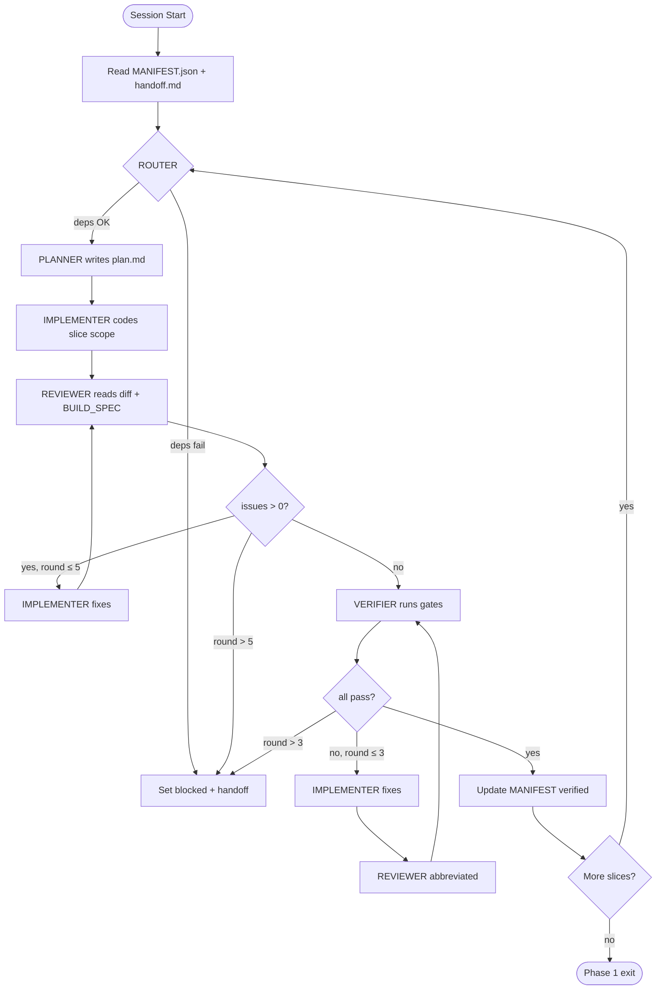

# LienLiberator — Development Harness

**Purpose:** The "Claude wrote its own software" loop for building LienLiberator Phase 1.  
**Audience:** Claude Code sessions, human operators, CI.  
**Config:** `config/harness/slice-orchestration.json`  
**Progress:** `MANIFEST.json`

---

## 1. Philosophy (Karpathy / Small Agents)

One mega-prompt fails because:

- Context fills with irrelevant BUILD_SPEC sections
- Review quality degrades when implement + review share one head
- Verification gets skipped under time pressure

**Fix:** Five harness roles, five prompt files, one active role per turn.

| Principle | Implementation |
|-----------|----------------|
| Specialization | `prompts/agents/{ROLE}.md` — narrow instructions |
| State on disk | `MANIFEST.json` + `.claude/session/{slice}/` |
| Deterministic gates | `run-slice.sh` runs same commands every time |
| Fix loops | REVIEWER ↔ IMPLEMENTER until `issues.length === 0` |
| No silent skip | VERIFIER must pass before slice → `verified` |

Product agents (INTAKE, DRAFTER, …) are **runtime** LLM roles. Harness agents are **build-time** roles. Names collide only for VERIFIER — harness VERIFIER runs tests; product VERIFIER validates evidence OCR.

---

## 2. Loop Diagram



### ASCII equivalent

```
┌─────────────┐
│ SESSION     │
│ START       │
└──────┬──────┘
       ▼
┌─────────────┐     missing dep
│ ROUTER      │────────────────► blocked
└──────┬──────┘
       ▼
┌─────────────┐
│ PLANNER     │  plan.md
└──────┬──────┘
       ▼
┌─────────────┐
│ IMPLEMENTER │  code in scope_files only
└──────┬──────┘
       ▼
┌─────────────┐     issues>0 ──┐
│ REVIEWER    │◄───────────────┘ (max 5)
└──────┬──────┘
       │ issues=0
       ▼
┌─────────────┐     fail ──┐
│ VERIFIER    │◄─────────┘ (max 3)
└──────┬──────┘
       │ pass
       ▼
┌─────────────┐
│ MANIFEST    │  status=verified, active_slice++
└─────────────┘
```

---

## 3. Roles

### 3.1 ROUTER

- **Input:** `MANIFEST.json`, `slice-orchestration.json`
- **Output:** `.claude/session/{slice}/route.json`
- **Job:** Confirm `depends_on` slices are `verified`; set `harness_state`; tell human which agent prompt to load next
- **Never:** Edit application code

### 3.2 PLANNER

- **Input:** Slice definition, BUILD_SPEC `spec_refs`, prior slice `summary.md`
- **Output:** `.claude/session/{slice}/plan.md`
- **Job:** File-level task list, test plan, risk register, explicit out-of-scope list
- **Never:** Write `app/` or `lib/` (except plan)

### 3.3 IMPLEMENTER

- **Input:** `plan.md`, slice `scope_files`, BUILD_SPEC sections
- **Output:** Git diff
- **Job:** Implement exactly the plan; check off tasks in plan.md
- **Never:** Files in `forbidden_in_slice` or future slices

### 3.4 REVIEWER

- **Input:** Git diff, `plan.md`, BUILD_SPEC, `scripts/harness/review-checklist.md`
- **Output:** `.claude/session/{slice}/review-round-{n}.json`
- **Job:** Find spec violations, security issues, missing tests
- **Never:** Fix code (only describe fixes)

### 3.5 VERIFIER (harness)

- **Input:** Slice `verification.commands` from orchestration JSON
- **Output:** `.claude/session/{slice}/verification.json`, updates `MANIFEST.verification`
- **Job:** Run `run-slice.sh --verify-only`; report pass/fail per gate
- **Never:** Change code

---

## 4. State Machine (`harness_state`)

| State | Meaning | Next agent |
|-------|---------|------------|
| `idle` | No work in flight | ROUTER |
| `routing` | ROUTER active | PLANNER |
| `planning` | PLANNER active | IMPLEMENTER |
| `implementing` | IMPLEMENTER active | REVIEWER |
| `reviewing` | REVIEWER active | IMPLEMENTER or VERIFIER |
| `fixing` | Fix loop after review/verify | REVIEWER |
| `verifying` | VERIFIER active | IMPLEMENTER or done |
| `blocked` | Max rounds or dep failure | Human |
| `slice_complete` | Slice verified | ROUTER (next slice) |

Types: `lib/loops/agent-harness.ts`

---

## 5. Exit Criteria

### 5.1 Per-slice exit

All must be true:

1. `review-round-{final}.json` → `"issue_count": 0`
2. `verification.json` → `"passed": true`
3. Every `acceptance_criteria` item checked in `summary.md`
4. `MANIFEST.slices[n].status === "verified"`
5. `pnpm verify:no-auto-send` exit 0

### 5.2 Phase 1 exit (after slice-11)

From BUILD_SPEC §13:

> guest intake → auth merge → L1 letter → mark-sent → audit log

Verified by:

```bash
bash scripts/harness/run-slice.sh --verify-phase-exit
pnpm test:e2e:smoke
```

### 5.3 Session exit (partial work OK)

Always write `handoff.md` with:

- `harness_state`, `fix_round`, `last_agent`
- Commands run + exit codes
- Files touched
- Next agent + first action

---

## 6. Running the Harness

### 6.1 Full slice (human drives agents)

```bash
cd lienliberator

# 1. Route
# Claude adopts ROUTER.md → writes route.json

# 2. Plan
# Claude adopts PLANNER.md → writes plan.md

# 3. Implement
# Claude adopts IMPLEMENTER.md → code

# 4. Review loop
# Claude adopts REVIEWER.md → review-round-N.json
# Repeat until issue_count=0

# 5. Verify
bash scripts/harness/run-slice.sh --verify-only
# Claude adopts VERIFIER.md → verification.json

# 6. Complete
bash scripts/harness/run-slice.sh --complete-slice
```

### 6.2 Verify only (CI or resume)

```bash
bash scripts/harness/run-slice.sh --verify-only
```

### 6.3 Show status

```bash
bash scripts/harness/run-slice.sh --status
```

---

## 7. Session Directory Layout

```
lienliberator/.claude/session/slice-05/
├── route.json           # ROUTER output
├── plan.md              # PLANNER output
├── review-round-1.json  # REVIEWER
├── review-round-2.json
├── verification.json    # VERIFIER
├── summary.md           # Post-slice narrative
└── handoff.md           # Last session state (always latest)
```

**Gitignore:** `.claude/session/` (local state; MANIFEST is committed)

---

## 8. Review JSON Schema

```json
{
  "slice_id": "slice-05",
  "round": 1,
  "reviewer": "REVIEWER",
  "issue_count": 0,
  "issues": [
    {
      "id": "R1",
      "severity": "blocker|major|minor|nit",
      "category": "spec|security|test|style|hallucination",
      "file": "lib/agents/intake/runner.ts",
      "line": 42,
      "finding": "Uses ESCALATION_L1 status string",
      "spec_ref": "BUILD_SPEC.md §16 #1",
      "fix_hint": "Use case_status escalation with level L1"
    }
  ],
  "passed_checklist_sections": ["forbidden-patterns", "state-machine"],
  "approved": false
}
```

`approved: true` only when `issue_count === 0`.

---

## 9. Verification JSON Schema

```json
{
  "slice_id": "slice-05",
  "timestamp": "2026-06-20T12:00:00Z",
  "passed": true,
  "gates": {
    "typecheck": { "command": "pnpm typecheck", "exit_code": 0 },
    "lint": { "command": "pnpm lint", "exit_code": 0 },
    "unit_tests": { "command": "pnpm test:unit", "exit_code": 0 },
    "verify_no_auto_send": { "command": "pnpm verify:no-auto-send", "exit_code": 0 }
  },
  "failed_gates": [],
  "slice_specific": []
}
```

---

## 10. Fix Loop Rules

| Loop | Max rounds | Entry | Exit |
|------|------------|-------|------|
| Review | 5 | `issues.length > 0` | `issue_count === 0` or `blocked` |
| Verify | 3 | any gate exit ≠ 0 | all gates pass or `blocked` |

After verify failure:

1. IMPLEMENTER fixes (no new scope)
2. REVIEWER runs **abbreviated** review (only prior issues + changed files)
3. VERIFIER re-runs all gates

Increment `MANIFEST.fix_round` each IMPLEMENTER pass in a loop.

---

## 11. Orchestration Reference

Phase 1 slice order is **fixed** in `config/harness/slice-orchestration.json`.

Agent pipeline per slice:

```
ROUTER → PLANNER → IMPLEMENTER → REVIEWER → (fix)* → VERIFIER → (fix)*
```

Do not run agents out of order. Do not skip PLANNER.

---

## 12. CI Integration (future)

```yaml
# .github/workflows/harness-verify.yml (stub)
- run: bash scripts/harness/run-slice.sh --verify-only
- run: test "$(jq -r .verification.passed MANIFEST.json)" = "true"
```

---

## 13. Troubleshooting

| Symptom | Cause | Fix |
|---------|-------|-----|
| ROUTER blocks | Prior slice not verified | Complete dependency slice |
| REVIEWER infinite nits | No severity rules | Only blockers/majors count toward issue_count |
| typecheck fails slice-01 | No tsconfig yet | Slice-01 allows migration-only; add minimal tsconfig in plan |
| Agent confuses product/harness VERIFIER | Name collision | Harness prompt says "run shell gates only" |

---

**Next:** `LOOP_ENGINEERING.md` — how product loops and dev loops mirror each other.