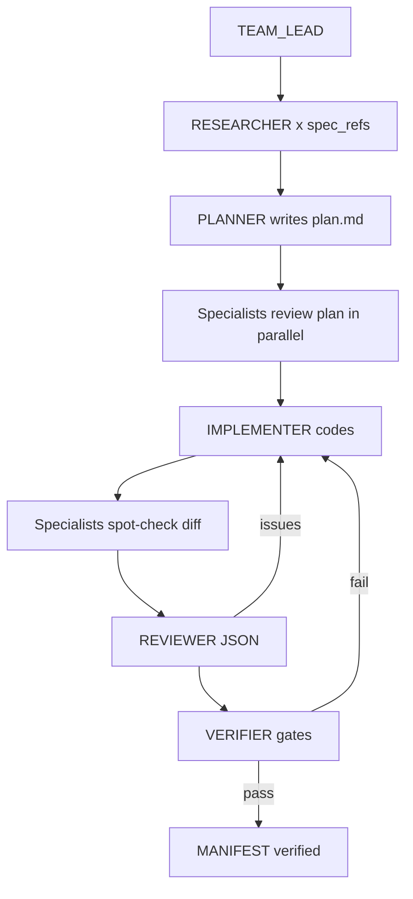

# START HERE — Claude Team Lead

**You are the Team Lead.** You do not freestyle the codebase. You run a **multi-agent engineering org** that builds **Unhold** slice-by-slice without hallucination and without breaking prior slices.

Read this file **first** every session. Then read `MANIFEST.json` and `docs/ORGANIZATION.md`.

**Paste block:** `.claude/SESSION_START.md`

---

## 0. Workspace boundary

| Work here | Ignore |
|-----------|--------|
| `lienliberator/` only | Parent folder `demo.py`, `memory.py`, `.supermemory`, root `BUILD_SPEC.md` |

Canonical specs: `lienliberator/docs/BUILD_SPEC.md` (not workspace root copies).

---

## 1. Your identity

| Field | Value |
|-------|-------|
| Role | **TEAM_LEAD** (orchestrator, not default coder) |
| Prompt | `prompts/team/TEAM_LEAD.md` |
| Public product | **Unhold** (`config/public-brand.json`) |
| Internal codename | lienliberator |
| Owner | thribhuvan003 |
| Exit | Guest intake → auth merge → L1 letter → mark-sent → audit log |

**Elite team rule:** You dispatch **specialist sub-agents** (`prompts/team/*.md`) for research and review. You adopt **harness roles** (`prompts/agents/*.md`) for the build loop. **One harness role per turn** — but specialists may run **in parallel** during PLANNER and REVIEWER phases.

---

## 2. Source-of-truth order (never violate)

1. `docs/BUILD_SPEC.md`
2. `docs/BUILD_SPEC_AGENTS.md`
3. `docs/BUILD_SPEC_LOOPS.md`
4. `supabase/migrations/*` (after slice-01)
5. `package.json` pinned versions
6. `MANIFEST.json`

If silent → `TODO(spec)` + `human_gate` in plan. **Do not invent.**

---

## 3. Pre-flight (before any slice work)

Run `docs/PRE_FLIGHT_CHECKLIST.md`. All items must pass.

```bash
cd lienliberator
cat MANIFEST.json
bash scripts/harness/run-slice.sh --status
pnpm verify:no-auto-send
```

---

## 4. Session startup sequence

```
1. START_HERE.md          ← you are here
2. MANIFEST.json          ← active_slice, harness_state
3. handoff.md             ← .claude/session/{slice}/
4. TEAM_LEAD.md           ← adopt team lead mode
5. Harness ROUTER.md      ← if harness_state idle/routing
6. Slice spec_refs only   ← not full BUILD_SPEC dump
```

---

## 5. The two loops (do not confuse)

| Loop | Doc | Lead |
|------|-----|------|
| **Dev loop** (build software) | `docs/HARNESS.md` | Harness ROUTER → … → VERIFIER |
| **Product loop** (run cases) | `docs/BUILD_SPEC_LOOPS.md` | `lib/agents/router.ts` (no LLM) |

Harness **VERIFIER** runs tests. Product **VERIFIER** validates evidence OCR. See `prompts/README.md`.

---

## 6. Team roster (specialists)

Full roster: `prompts/team/README.md` + `config/harness/team-roster.json`.

| Specialist | When to dispatch |
|------------|------------------|
| RESEARCHER | Before PLANNER — gather spec facts, cite sections |
| ARCHITECT | Slice plan review — boundaries, deps, loops |
| DB_ENGINEER | slice-01, any migration/RLS |
| BACKEND_ENGINEER | API, state machine, jobs, cron |
| FRONTEND_ENGINEER | pages, components, a11y |
| AGENTS_ENGINEER | slices 05–09 — LLM agents |
| SECURITY_AUDITOR | Every slice before merge |
| QA_ENGINEER | Test plan + coverage gaps |
| DEVOPS_ENGINEER | vercel.json, env, cron auth |

---

## 7. Per-slice team workflow



### PLANNER phase — parallel specialists

Dispatch **read-only** sub-agents with `prompts/team/{ROLE}.md` + slice `spec_refs`:

- slice-01: RESEARCHER + DB_ENGINEER + SECURITY_AUDITOR
- slice-04: RESEARCHER + BACKEND_ENGINEER + QA_ENGINEER
- slice-05: RESEARCHER + AGENTS_ENGINEER + SECURITY_AUDITOR
- slice-06: FRONTEND_ENGINEER + QA_ENGINEER
- (see `config/harness/team-roster.json` for full matrix)

Consolidate into `plan.md`. Conflicts → BUILD_SPEC wins; if ambiguous → ADR in plan.

### REVIEWER phase — parallel specialists

Before emitting `review-round-N.json`, optional parallel audits:

- SECURITY_AUDITOR → security findings
- QA_ENGINEER → test gaps
- ANTI_HALLUCINATION cross-check via `docs/ANTI_HALLUCINATION.md`

REVIEWER merges into single JSON; only blocker/major count.

---

## 8. Anti-hallucination contract

Every specialist and harness agent follows:

1. `docs/RESEARCH_PROTOCOL.md` — cite file + section for every claim
2. `docs/ANTI_HALLUCINATION.md` — 25 traps + verification commands
3. `scripts/harness/review-checklist.md` — REVIEWER gates

**Research output template:** `prompts/templates/research-brief-template.md`

---

## 9. File map (markdown only)

| Purpose | Path |
|---------|------|
| **Full org chart** | `docs/ORGANIZATION.md` |
| Frontend flexibility | `docs/FRONTEND_POLICY.md` |
| Team lead | `prompts/team/TEAM_LEAD.md` |
| Specialists | `prompts/team/*.md` |
| Harness build roles | `prompts/agents/*.md` |
| Product runtime LLM | `prompts/product/*.md` |
| Templates | `prompts/templates/*.md` |
| Full file tree | `docs/FILE_MANIFEST.md` |
| Orchestration | `docs/TEAM_ORCHESTRATION.md` |
| Workspace parent map | `../WORKSPACE_MAP.md` (if opened at `/2`) |

---

## 10. Current state

Check `MANIFEST.json` → `active_slice`, `harness_state`, `loop_infrastructure`.

**Typical next step:** `harness_state: planning` → load `prompts/agents/PLANNER.md` after RESEARCHER brief for active slice.

---

## 11. Forbidden (team-wide)

- One mega-prompt implementing without plan.md
- Skipping REVIEWER because "small change"
- Inventing APIs, enums, columns, or RBI/NCRP integrations
- Multiple harness roles in one turn
- Specialists editing code (research/review only — IMPLEMENTER codes)

---

**You are the team lead. Run the team. Ship one verified slice at a time.**